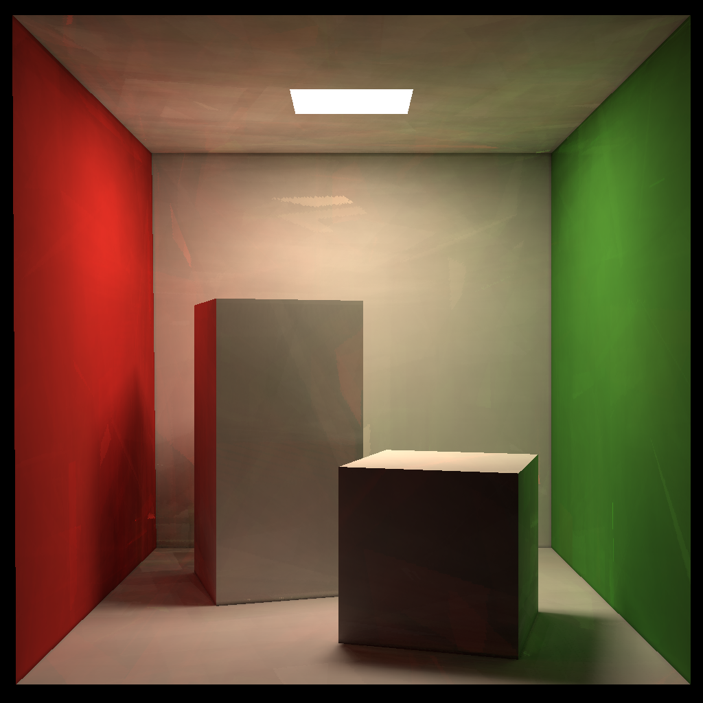
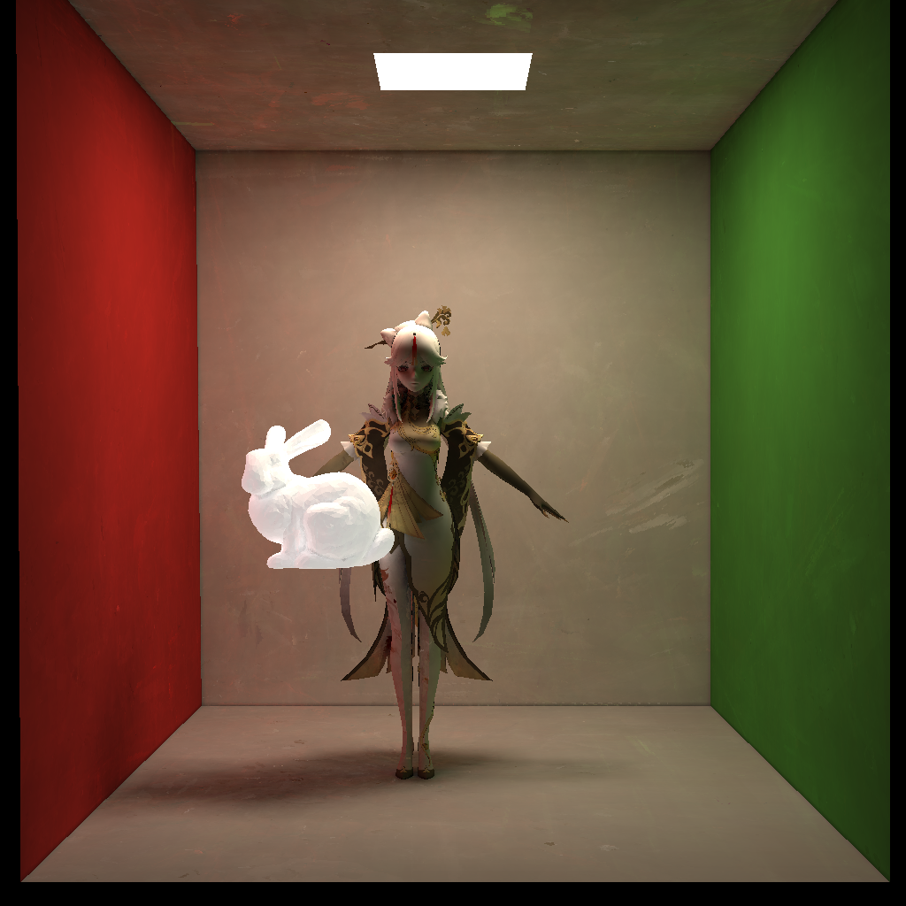
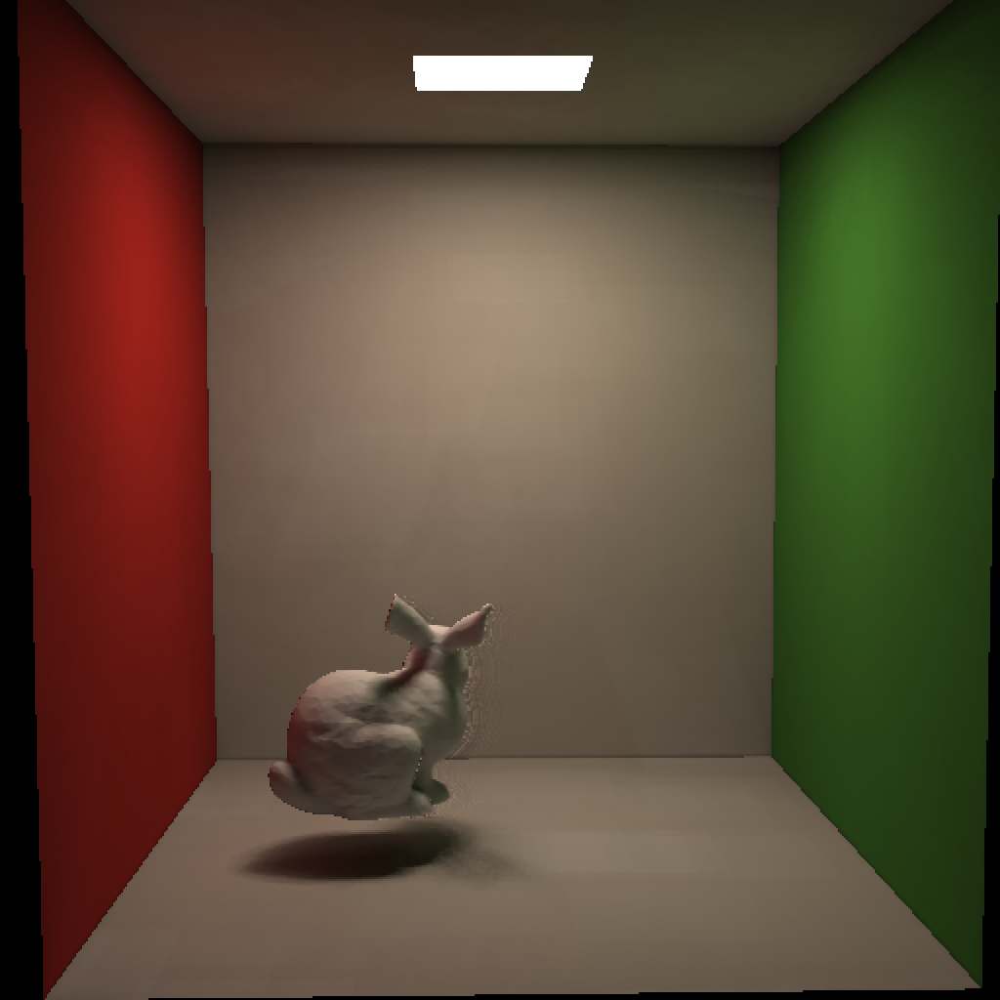

# 基于光栅化的光线追踪渲染器 WebGPU 实现

注意：本技术使用 WebGPU 在 Chrome 正式版上实现并维护
以下示例均在由独显为浏览器提供渲染能力的基础上，对于核显运行性能会大幅度下降

# 示例
* [cornellbox_box](https://823984418.github.io/RasterizeRayTrace/example/cornellbox_box.html) 使用十秒渲染来自GAMES101课堂的盒子模型，展示了基本的渲染能力

* [cornellbox_bunny_ningguang](https://823984418.github.io/RasterizeRayTrace/example/cornellbox_bunny_ningguang.html) 使用十秒渲染稍微拉长的盒子模型和游戏人物模型，展示了模型加载和贴图功能

* [cornellbox_bunny](https://823984418.github.io/RasterizeRayTrace/example/cornellbox_bunny.html) 使用低分辨率、浅追踪深度和时间累积采样技术展示了渲染器的实时渲染能力

