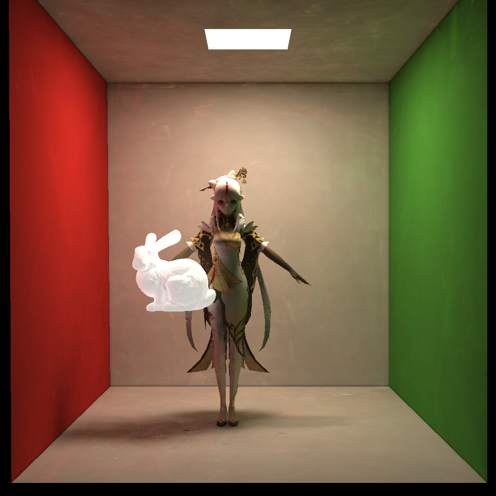
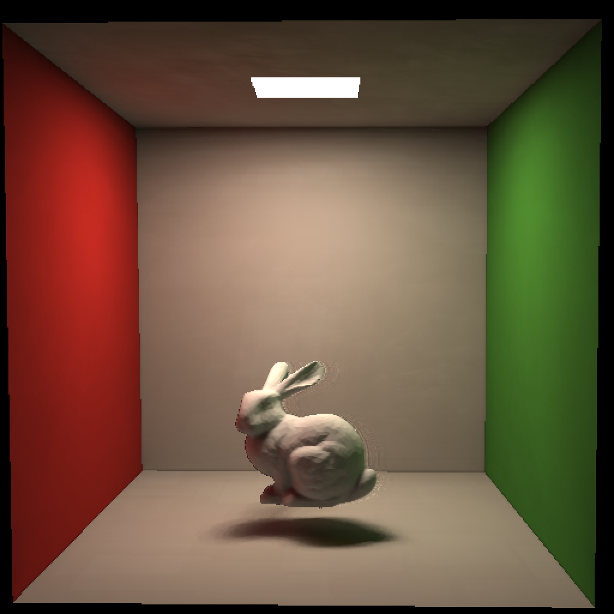

# 基于光栅化的光线追踪渲染器 WebGPU 实现

# 示例
* `cornellbox_box` 使用十秒渲染来自GAMES101课堂的盒子模型，展示了基本的渲染能力

* `cornellbox_bunny_ningguang` 使用十秒渲染稍微拉长的盒子模型和游戏人物模型，展示了模型加载和贴图功能

* `cornellbox_bunny` 使用低分辨率、浅追踪深度和时间累积采样技术展示了渲染器的实时渲染能力

